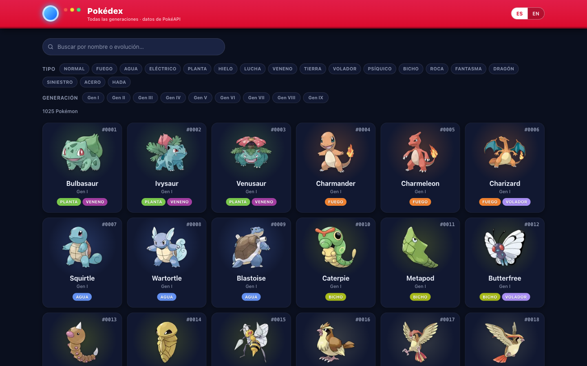

# Pokédex

Explorador en tiempo real de las ~1025 especies Pokémon (Generaciones I–IX) construido sobre la [PokéAPI](https://pokeapi.co) con **TypeScript** y **Next.js 15**. Búsqueda instantánea que contempla la cadena evolutiva, filtros por tipo y generación, ficha de detalle con estadísticas y evoluciones, interfaz bilingüe (ES/EN) y estado de la lista sincronizado con la URL.



**Demo:** https://pokedex-battle.onrender.com

> Alojada en un plan gratuito: si el servicio lleva un rato inactivo, el primer acceso puede tardar ~30-60 s en «despertar»; a partir de ahí responde con normalidad.

## Ejecución

Requiere Node 20+ y [pnpm](https://pnpm.io).

```bash
pnpm install
pnpm dev            # http://localhost:3000
```

Producción:

```bash
pnpm build
pnpm start
```

Con Docker, en un solo comando:

```bash
docker compose up --build   # sirve en http://localhost:3000
```

## Funcionalidades

- **Listado completo** de las ~1025 especies de las Generaciones I–IX, ordenado por número, mostrando nombre, generación, tipos y sprite.
- **Filtros** por tipo y por generación (con íconos y color de energía por tipo), combinables entre sí.
- **Búsqueda en tiempo real** por nombre que además **contempla la cadena evolutiva**: buscar «Pikachu» muestra también Pichu y Raichu, porque cada especie indexa los nombres de toda su línea evolutiva.
- **Ficha de detalle** estilo *scanner* con nombre, imagen, generación, tipos, estadísticas base animadas y la cadena evolutiva completa (con imágenes), resaltando claramente el Pokémon actual. Al pulsar una evolución se navega a su ficha.
- **Estado restaurable:** la búsqueda y los filtros viven en la URL (`?q=&types=&gens=`); al volver del detalle al listado se conserva exactamente la vista (filtros, texto y posición de scroll). El filtrado ocurre en el cliente sin recargar (History API).
- **Interfaz bilingüe ES/EN** con conmutador de idioma (persistido en cookie).
- **Renderizado progresivo:** las tarjetas se cargan en páginas de 60 mediante `IntersectionObserver`.

## Decisiones técnicas

**Agregación en el servidor + caché, en lugar de llamadas directas desde el cliente.**
Los datos siempre se originan en la PokéAPI en tiempo de ejecución (no hay ningún dataset commiteado). En el primer arranque en frío el servidor construye un índice a partir de ~580 peticiones agrupadas en lotes y lo cachea con `unstable_cache` (revalidación cada 24 h), además de la caché de `fetch` de Next. El resto de peticiones se sirven del índice ya materializado.

**La URL como única fuente de verdad del estado de la lista.**
Los filtros y la búsqueda se codifican en la query string y se sincronizan con la History API (`replaceState`), de modo que filtrar no dispara una navegación al servidor y la vista es restaurable y compartible. Volver del detalle recupera la última URL de lista desde `sessionStorage`.

**Búsqueda que abarca la cadena evolutiva.**
Al construir el índice, cada especie guarda los slugs de todos los miembros de su línea evolutiva, así que una coincidencia por nombre trae a toda la familia sin peticiones adicionales en tiempo de búsqueda.

**Tipado estricto en la frontera con la PokéAPI.**
Las respuestas se tipan explícitamente en `lib/pokeapi` y se transforman en modelos de dominio limpios; la UI nunca ve la forma cruda de la API.

**Sprites a través del optimizador de imágenes de Next.**
Las imágenes se sirven desde el repositorio de sprites de la PokéAPI y pasan por `next/image`, que actúa como caché/proxy en el servidor; ante un *rate-limit* transitorio se reintenta y, como último recurso, se muestra un placeholder local.

## Arquitectura

```
src/
├── app/                 Páginas RSC (listado, /pokemon/[id])
├── components/pokedex/  Presentación del explorador (tarjetas, filtros, stats…)
├── hooks/               Hooks de cliente (filtros en URL)
└── lib/
    ├── pokeapi/         Cliente HTTP tipado + loaders cacheados
    ├── domain/          Lógica pura del explorador (índice, filtro, evolución)
    └── i18n/            Locale por cookie, diccionarios ES/EN, provider
```

## Calidad

```bash
pnpm lint         # ESLint
pnpm typecheck    # tsc --noEmit (TypeScript en modo strict)
pnpm test         # Vitest (148 tests)
pnpm format       # Prettier
```

Los tests cubren de forma determinista la lógica de dominio del explorador: construcción del índice, filtrado combinado, búsqueda por cadena evolutiva, serialización del estado en la URL y los diccionarios de i18n.

## Extra: combate multijugador 3v3 (opcional)

Más allá de lo pedido, el proyecto incluye un **modo de combate por turnos entre dos jugadores en tiempo real** (Socket.IO), con equipos aleatorios de 3 Pokémon, fórmula de daño real, tabla de efectividad de los 18 tipos, estados y una escena con estética retro. Es un añadido para lucir la PokéAPI; no forma parte de los requisitos.

- Está disponible en la demo y en local/Docker en `/battle`: pulsa **Crear combate** y comparte el enlace de la sala con la otra persona.
- El motor de combate vive en `lib/battle` como funciones puras y deterministas (RNG inyectado), con el servidor como autoridad y Socket.IO desacoplado tras una interfaz.

## Uso de IA

Se emplearon herramientas de asistencia por IA como apoyo durante el desarrollo. Todas las decisiones de arquitectura, el diseño y el código fueron revisados y validados manualmente; comprendo y puedo defender cada parte de la solución.
</content>
